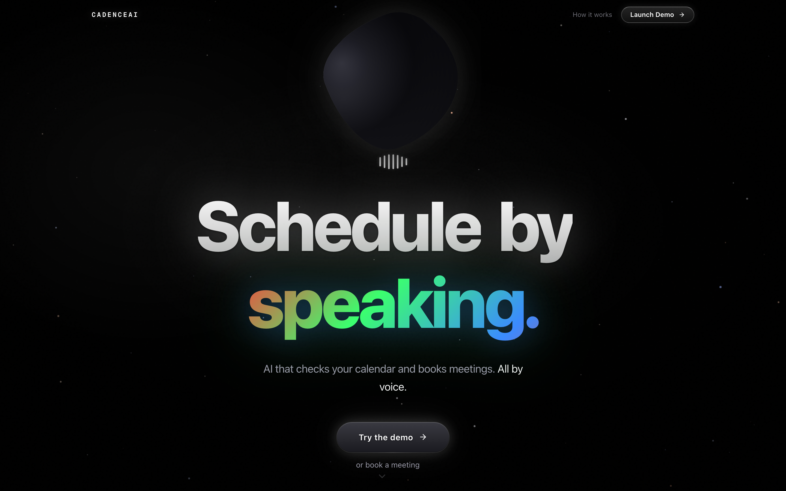
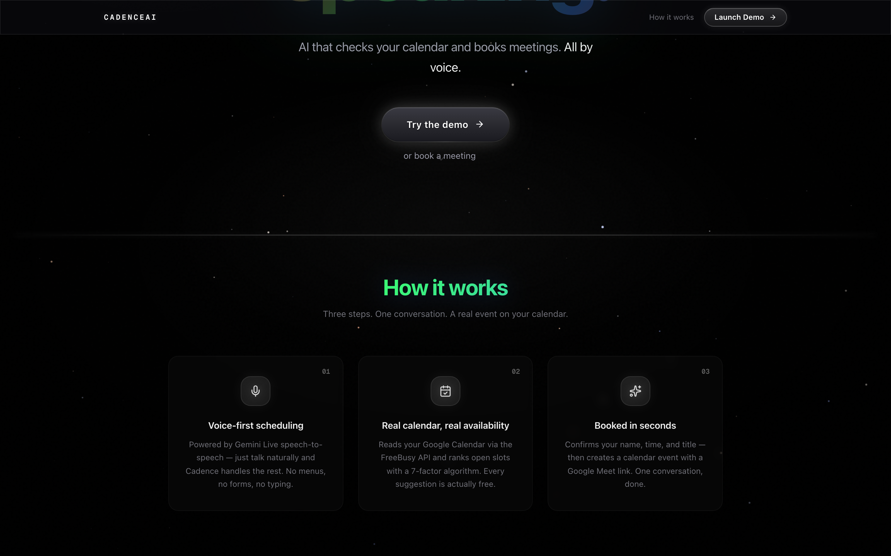
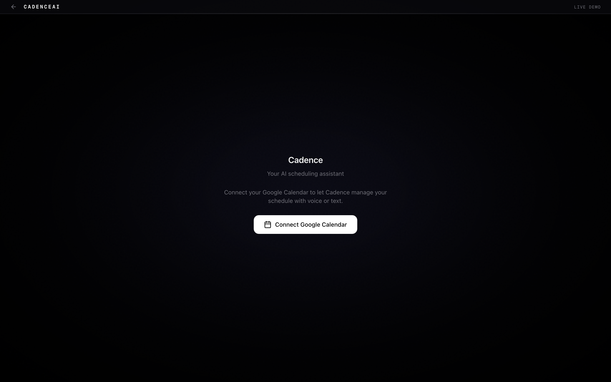

# CadenceAI

Voice AI scheduling assistant powered by Gemini Live speech-to-speech, LangGraph orchestration, and Google Calendar.

## Grading Checklist

| # | Requirement | Implementation |
|---|-------------|---------------|
| 1 | Real-time voice conversation | Gemini 2.5 Flash native audio via Pipecat WebRTC (`server/bot.py`) |
| 2 | Collect name, date/time, title | 5-step conversation flow in `server/system_prompt.py` |
| 3 | Confirmation before booking | Step 4 confirms all details before proceeding (`system_prompt.py`) |
| 4 | Real Google Calendar event + Meet link | `server/tools/calendar_client.py` - OAuth 2.0, Events API, auto-provisioned Meet |
| 5 | Text fallback | `POST /api/chat` endpoint (`server/chat/routes.py`) + inline text input in UI |

## Home

**Live**: [https://web-amber-ten-59.vercel.app/demo](https://web-amber-ten-59.vercel.app/demo)

### How to Test

1. Open the demo link above
2. Click **Connect** and allow microphone access
3. Say: *"Book a 30 minute meeting tomorrow at 2pm called Team Sync"*
4. The agent will ask your name, confirm the details, then book the event
5. A real Google Calendar event with a Google Meet link is created

You can also type instead of speaking using the text input at the bottom of the screen.

## Quick Start

### Prerequisites
- Python 3.11+, Node.js 18+
- Google Cloud project with Calendar API enabled
- OAuth 2.0 credentials (client ID + secret + refresh token)
- Gemini API key

### Setup

```bash
git clone <repo-url> && cd CadenceAI

# Server
cd server
cp ../.env.example .env        # Fill in API keys
pip install -r requirements.txt
uvicorn main:app --host 0.0.0.0 --port 7860

# Frontend (new terminal)
cd web
npm install
npm run dev                     # http://localhost:3000
```

Or use Docker:
```bash
docker compose up
```

## Running Tests

```bash
# All tests (server + frontend)
make test

# Or without make:
./scripts/test.sh

# Individual suites
make test-server    # cd server && python -m pytest -v
make test-web       # cd web && npx vitest run
```

## Calendar Integration

The agent connects to Google Calendar via OAuth 2.0 (`server/tools/calendar_client.py`):

1. **Authentication**: OAuth 2.0 with refresh tokens, credentials auto-refresh on expiry
2. **Availability check**: FreeBusy API queries the user's calendar for busy blocks, then `compute_free_slots()` finds open windows and `rank_slots()` scores them with 7 factors (time preference, buffer, focus time, lunch protection, edge penalty, meeting fatigue)
3. **Event creation**: Events API creates the event with `conferenceData` to auto-provision a Google Meet link. A deterministic `requestId` (SHA-256 of title + time + attendees) prevents duplicate Meet rooms
4. **Race condition protection**: Before booking, `verify_free` re-checks the slot is still available to prevent double-booking

Flow: `check_availability → fetch_busy → compute_slots → rank → confirm → create_event → book_event`

## Screenshots

### Landing Page


### How It Works


### Connect to Google Calendar Page


### Booking Meeting To Calendar Demo
<!-- Replace with your Loom link after recording -->
[Watch the full walkthrough on Loom](TODO)

## Tech Stack

- **Voice**: Pipecat + Gemini 2.5 Flash Live (speech-to-speech WebRTC)
- **Orchestration**: LangGraph state machine (check → rank → book)
- **Backend**: FastAPI, Google Calendar API, OAuth 2.0
- **Frontend**: Next.js 16, React 19, Framer Motion, Zustand
- **Ranking**: 7-factor slot scoring (preference, buffer, focus, lunch, fatigue)

## Project Structure

```
CadenceAI/
├── server/                 # FastAPI + Pipecat + LangGraph
│   ├── main.py             # API routes (health, offer, audit)
│   ├── bot.py              # Pipecat voice pipeline
│   ├── system_prompt.py    # 5-step conversation flow
│   ├── tools/              # Schemas, handlers, calendar client
│   ├── graph/              # LangGraph nodes, edges, state
│   ├── utils/              # Slot ranker, time utils, audit log
│   └── tests/              # pytest suite (~55 tests)
├── web/                    # Next.js 16 frontend
│   ├── src/components/     # Voice orb, calendar, captions
│   ├── src/hooks/          # useTranscript, useMonthCalendar
│   └── src/__tests__/      # vitest suite (~40 tests)
├── extension/              # Chrome extension (side-panel)
├── Makefile                # make test / make install
└── scripts/test.sh         # Shell test runner
```
